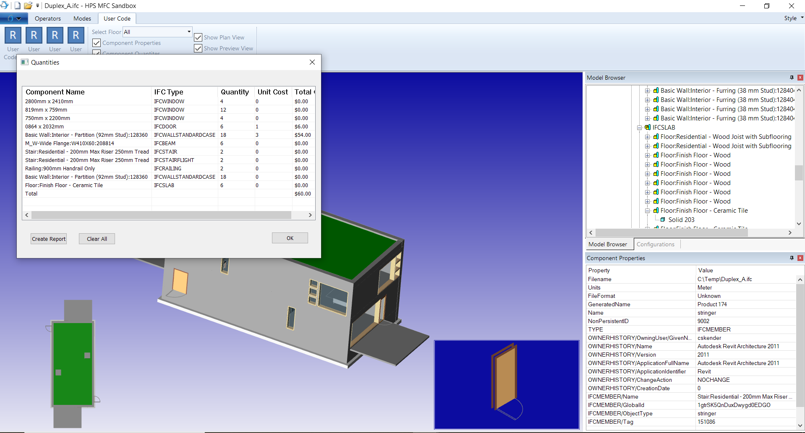
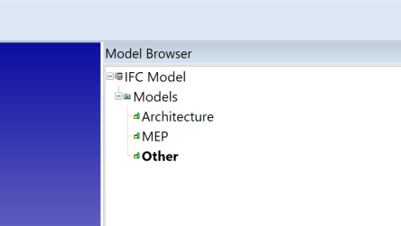
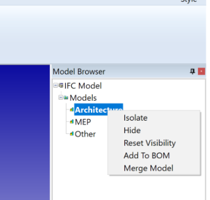

# BIM Viewer
A sample application built on top of the HOOPS Native Platform (HOOPS Exchange, Visualize and Publish) that loads IFC files into a win64 application and provides advanced data navigation like meta data display, quantity takeoff, floor sectioning, cutting planes, BOM creation, federated model combination and more. It is based on the mfc_sandbox sample project.

This project shows the completed form of the BIM Tutorial from the HOOPS Native Platfrom.

## Getting Started
Clone this repo into \HOOPS_202X\samples

## User Interface 
All BIM functionality is found on the User Code Tab of the Ribbon Bar, with one exception, an extra context menu item on the model browser.

### Model Import
Import an IFC file.  During loading, the HPS::Component structure will be parsed to identify Components corresponding to floor levels. The values are loaded into an MFC combo box which can be used to display a floor ( IFCBUILDINGSTOREY ).

### Component Properties
An additional MFC pane has been defined to show properties associated with component selected in the model browser. A check box controls display.

### Plan View Inset Window
Inset window with transparent background which shows a plan view. A check box controls display. It uses a cutplane whose height is controlled by the combo box.

### Component Quantities Modeless Dialog
-	Captures IFC objects selected by the user (window, etc). It records the quantity found and allows input of a unit cost. The cost of the entire list is totalled at the end.
-	Click twice ( not double click ) on the unit cost box to edit it.
-	Selecting a line will update the Preview window with the selected object
-	You can also generate a PDF

### Preview Window
Optional Preview Window with solid back ground.  Displays the currently selected item in the quantity dialog. Also a side effect of adding a new item to the dialog will show the newly added component.

### Add to BOM
Model Browser context menu item will add the selected item to the quantity list. The selected item has to represent a valid IFC type.  

### Model Federation
Load the PRC template file to create a product structure with nodes for Architecture and MEP.

Select the node you want to import to and use.

